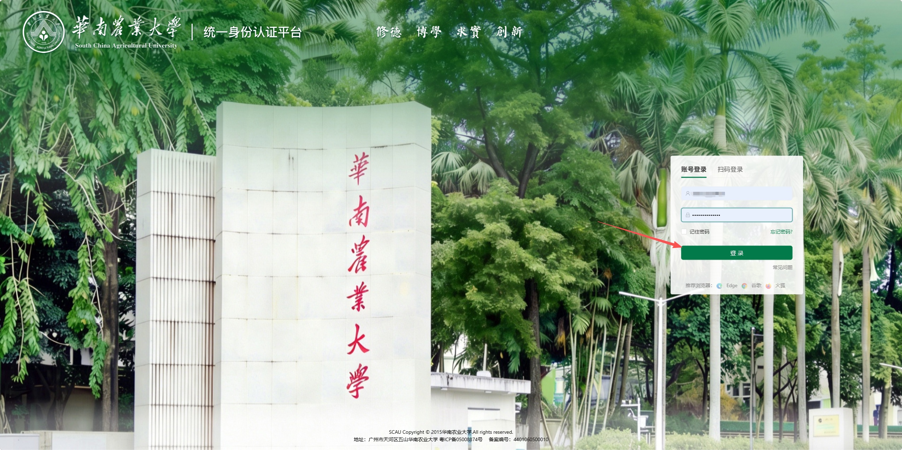
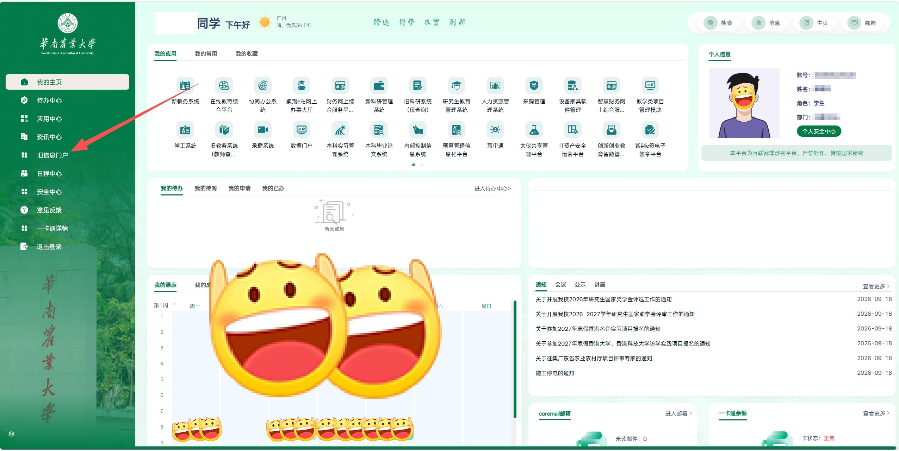
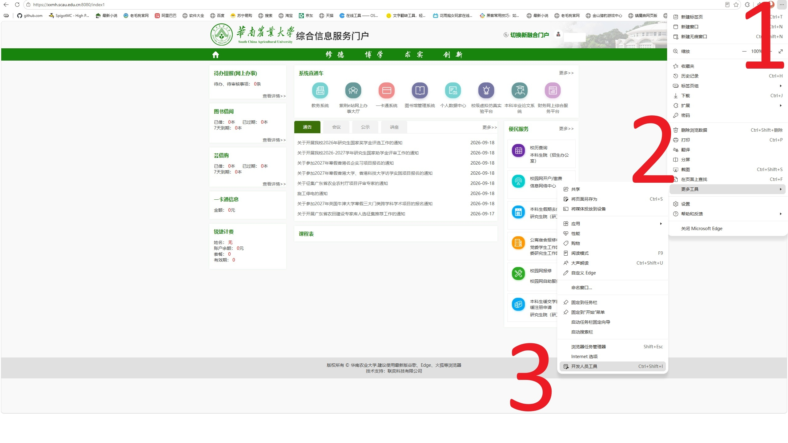
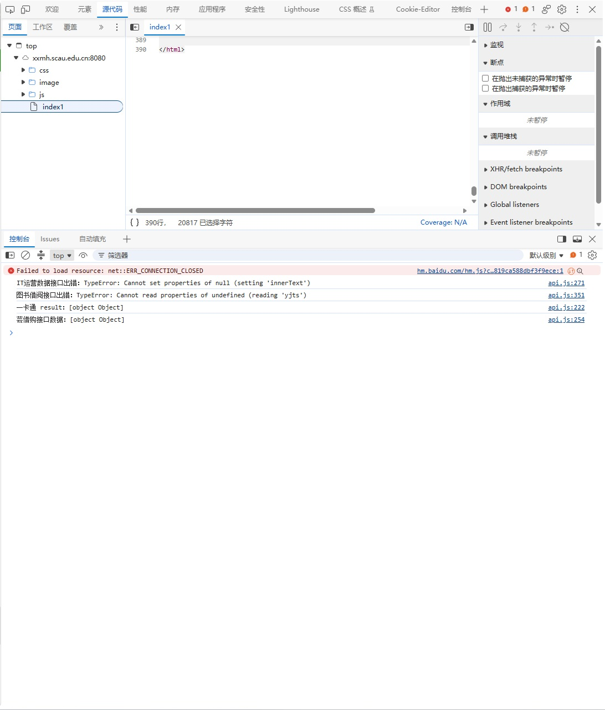
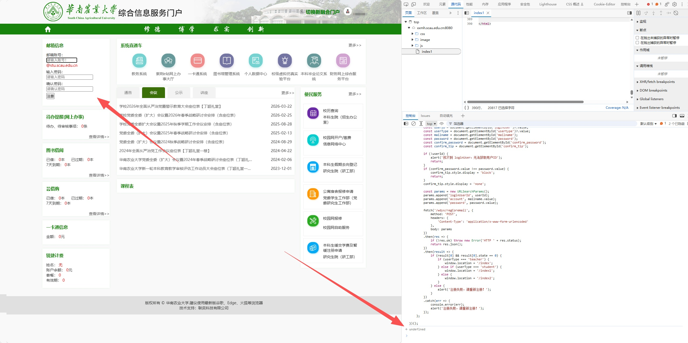

# SCAU 学生自定义邮箱注册教程

SCAU 的学生自定义邮箱注册流程相对简单，但需要注意一些细节。本文将详细介绍如何为自己的学生账户申请并使用自定义邮箱。

## 注册步骤

1. **访问主页**  
   打开浏览器，访问 [SCAU官网](https://www.scau.edu.cn/)。

2. **登录融合门户**  
   点击融合门户，登录自己的账号，进入融合门户。
   
   

3. **进入旧信息门户**  
   进入融合门户后，点击左侧“旧信息门户”，进入旧版信息门户。
   

4. **打开开发人员工具**  
   按照图片中的操作步骤，打开开发人员工具（以下为Chromium浏览器操作，具体浏览器可能有所不同，默认开发人员工具下方页面为控制台）。
   
   

5. **恢复注册入口**  
   在控制台中输入以下代码并回车：
```javascript
   (function(){
    const old = document.querySelector('.myEmail');
    if (old) old.remove();

    const myEmail = document.createElement('div');
    myEmail.className = 'myEmail';
    myEmail.innerHTML = `
        <div class="topCarCard">
            <div class="cardTitle">邮箱信息</div>
        </div>
        <div class="contentCard">
            <div id="has_regrister_mail" style="display: block;">
                <form>
                    <p>邮箱账号：<br/>
                        <input style="width:50%" type="text" name="mailname" id="mailname"
                               placeholder="请输入账号！">
                        <span class="redDataColor">@stu.scau.edu.cn</span>
                    </p>
                    <p>输入密码：<br/>
                        <input type="password" name="password" id="password" placeholder="请输入密码">
                    </p>
                    <p>确认密码：<br/>
                        <input type="password" name="confirm_password" id="confirm_password"
                               placeholder="请确认密码">
                    </p>
                    <span style="display: none;" id="confirm_tip"
                          class="redDataColor">请确认两次输入密码一致</span>
                    <p><input type="button" value="注册" id="regristerMailBtn"></p>
                </form>
            </div>
        </div>
    `;

    const left = document.querySelector('.main_content_left');
    if (!left) {
        alert('找不到 .main_content_left，无法插入邮箱卡片');
        return;
    }
    left.insertBefore(myEmail, left.firstChild);

    document.getElementById('regristerMailBtn').onclick = function() {
        const userId = document.getElementById('loginUser')?.value;
        const userType = document.getElementById('usertype')?.value;
        const mailname = document.getElementById('mailname');
        const password = document.getElementById('password');
        const confirm_password = document.getElementById('confirm_password');
        const confirm_tip = document.getElementById('confirm_tip');

        if (!userId) {
            alert('找不到 loginUser，无法获取用户ID');
            return;
        }
        if (confirm_password.value !== password.value) {
            confirm_tip.style.display = 'block';
            return;
        }
        confirm_tip.style.display = 'none';

        const params = new URLSearchParams();
        params.append('loginUserId', userId);
        params.append('account', mailname.value);
        params.append('password', password.value);

        fetch('/wdyx/regCoremail', {
            method: 'POST',
            headers: {
                'Content-Type': 'application/x-www-form-urlencoded'
            },
            body: params
        })
        .then(res => {
            if (!res.ok) throw new Error('HTTP ' + res.status);
            return res.json();
        })
        .then(result => {
            if (result[0] && result[0].state == 0) {
                if (userType === 'teacher') {
                    window.location = '/index';
                } else if (userType === 'student') {
                    window.location = '/index1';
                } else {
                    window.location = '/index2';
                }
            } else {
                alert('注册失败，请重新注册！');
            }
        })
        .catch(err => {
            console.error(err);
            alert('注册失败，请重新注册！');
        });
    };

})();
```

这将恢复注册入口，使其在页面上可见。


6. **填写信息并注册**  
   按照提示填写邮箱账号、密码和确认密码，然后点击“注册”按钮完成注册。

## 注意事项

- 注册时请确保提供的信息真实有效。
- 建议注册后绑定手机号，以免忘记密码。
- 如遇到问题，可联系学校技术支持获取帮助，总之别找我:D。
